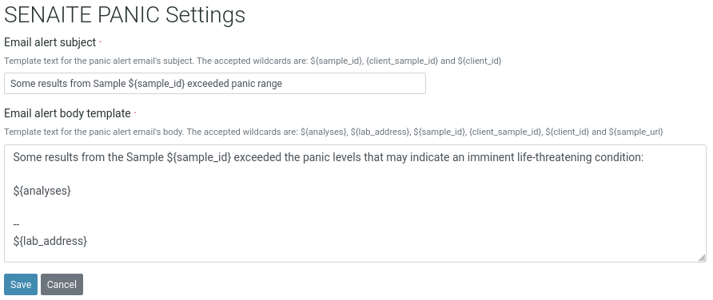
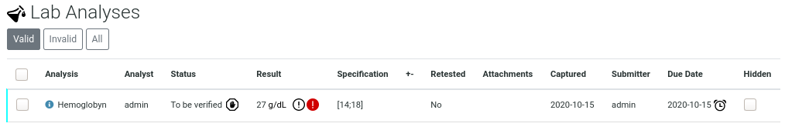
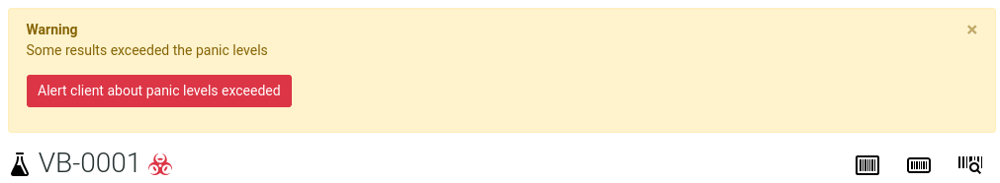
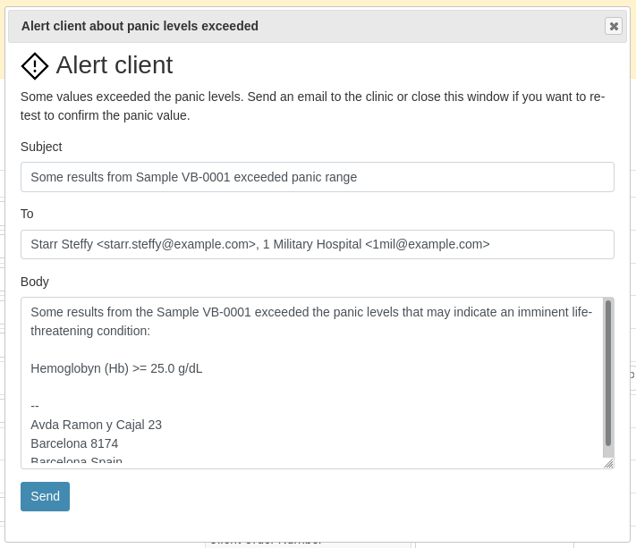

Quickstart
==========

This section gives an introduction about `senaite.panic`_. It assumes you
have `SENAITE LIMS`_ and `senaite.panic` already installed. Please read the
:doc:`installation` for further details.

.. _PanicSettings:

Panic settings
--------------

Visit the control panel view for `senaite.panic` to configure the settings.
This control panel is accessible to users with `Site Administrator` role,
through "Site Setup" view, "Add-on Configuration" section:

http://localhost:8080/senaite/@@panic-controlpanel

From this view you can configure the subject and e-mail to use for notifications
when the results are below the minimum panic value or above the maximum panic
value. Several wildcards like  ${analyses}, ${lab_address}, ${sample_id}, or
${sample_url} are supported.

Adding panic levels
-------------------

To add panic levels, click to the "gear" icon from top right, go to "Analysis
Specifications" view and either choose one or create a new one. In the
"specifications" section, choose the analysis, locate the columns "Panic < Min"
and "Panic > Max" and type the desired values.

.. image:: static/adding_panic_levels.png
  :width: 640
  :alt: Assignment of panic levels to an analysis through Specifications

Results in panic
----------------

When a result with a value that is either below the "Min panic" value or above
the "Max panic" value set in the specifications, the system displays a red alert
icon next to the result:

Email notification
------------------

When a result is "in panic", a notification panel is displayed at the top of the
sample view prompting the user to send an e-mail notification to the client
contact the sample is assigned to:

When the button is clicked, an e-mail form is displayed and auto-filled with
the subject and template created in the Panic Settings view:

.. Links

.. _senaite.panic: https://pypi.python.org/pypi/senaite.panic
.. _SENAITE LIMS: https://www.senaite.com
